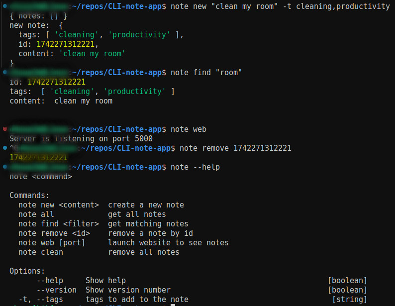
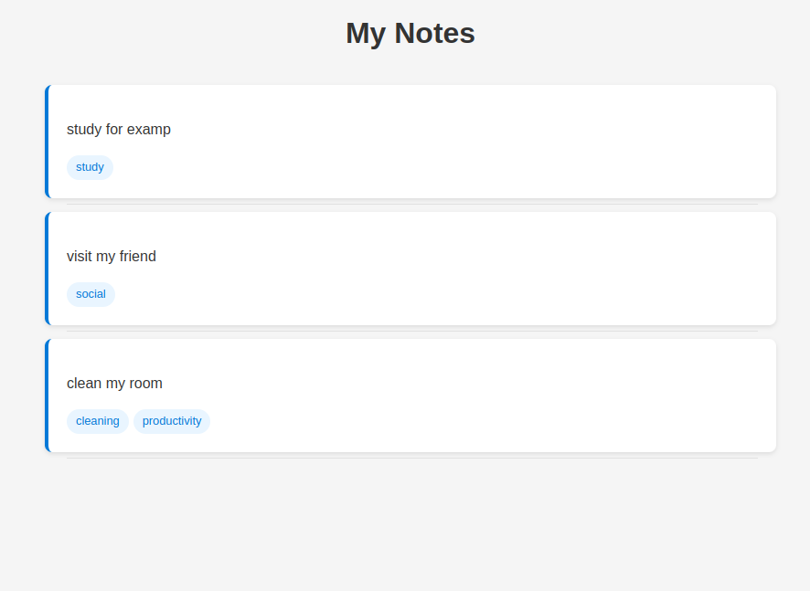

# CLI Note App

A simple CLI-based note-taking application that allows you to manage notes in the CLI




## Features

- Add with tags, remove, and list notes via CLI commands.
- Search for a single note
- View notes in a web browser.

## Installation

1. Clone the repository:
   git clone https://github.com/AtmaniChouaib22/cli-note-app.git
   cd cli-note-app
2. Install dependencies:
   npm install
3. run to create a symlink in global node_modules to point for the project
   ```
   npm link
   ```

# Usage

CLI Commands

```
  note new <content> -t(optional tags array) or --tags  create a new note
  note new <content> -t(tag1,tag2)  create a new note
  note all            get all notes in cli
  note find <filter>  get matching notes
  note remove <id>    remove a note by note id
  note web [port]     launch website to see notes
  note clean          remove all notes from the DB
  note --help         app help
  note --version      app version
```

Default port is 5000. You can specify a different port if needed.

### Example

To add a note:
note add "hello world" -t coding,python

To view notes in a web browser on port 4000:
note web 4000

## Project Structure

index.js: Entry point for the CLI commands.
notes.js: Contains functions for managing notes.
server.js: Contains functions for starting the web server.
template.html: HTML template for displaying notes.
DB.json stores all note objects

## Testing

To run tests, use the following command:
npm test

by AtmaniChouaib22
